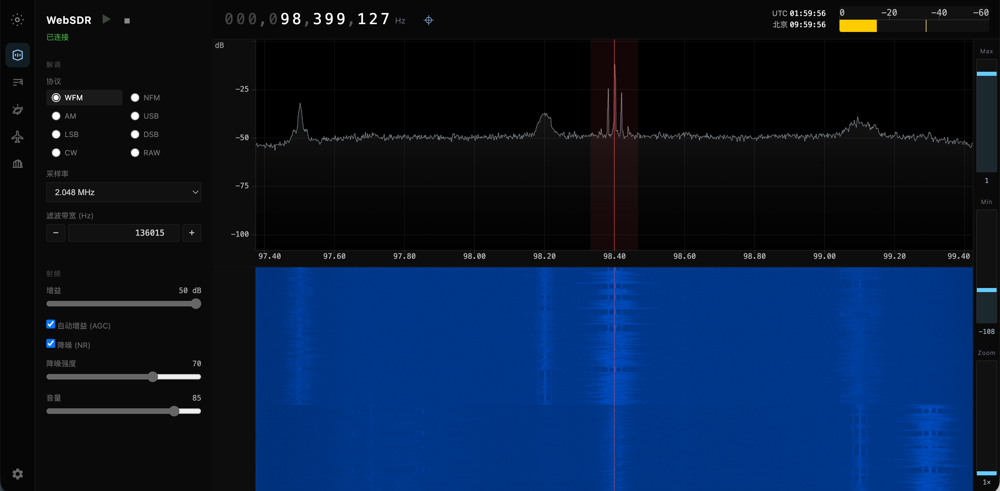
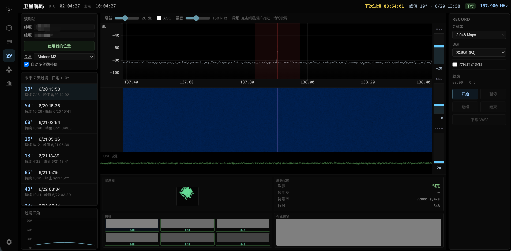
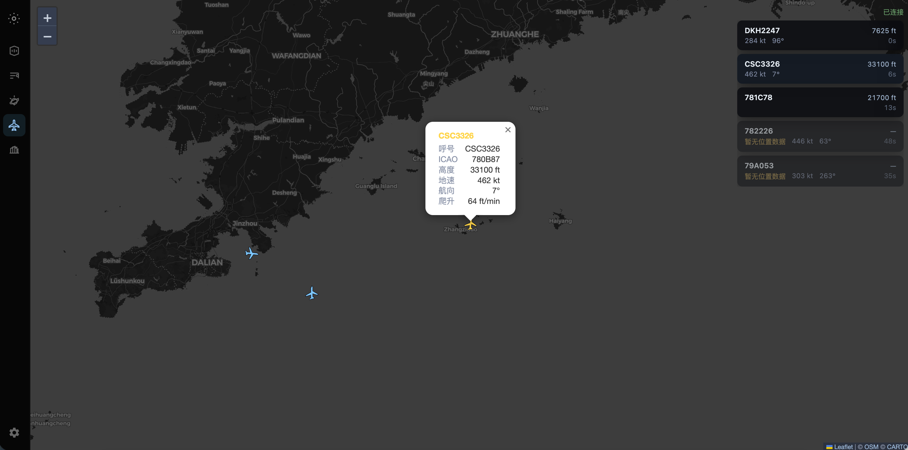
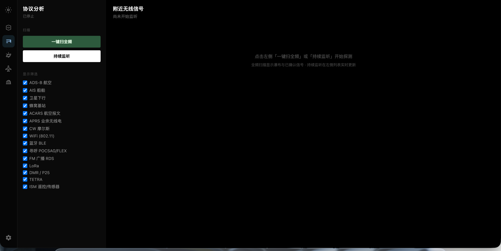

<div align="center">

# WebSDR

**浏览器里的软件定义无线电 — 频谱、解调、卫星 LRPT 一站搞定**

[](https://github.com/iamoumeng/websdr/actions/workflows/build.yml)
[](https://go.dev/)
[](https://vuejs.org/)
[](LICENSE)

[English](docs/README.en.md)

<table align="center" border="0" cellspacing="16" cellpadding="0">
  <tr>
    <td align="center"></td>
    <td align="center"></td>
  </tr>
  <tr>
    <td align="center"></td>
    <td align="center"></td>
  </tr>
</table>

</div>

---

## 简介

WebSDR 是基于 **Go + RTL-SDR + Vue 3** 的 Web 软件定义无线电接收器。插入 USB 接收棒，在浏览器中实时查看频谱与瀑布图、收听无线电信号，并支持 **Meteor-M 系列卫星 LRPT 实时图像解码**、~~NOAA APT~~、ADS-B、AIS 与多协议自动识别。

## 推荐设备

本项目通过 [librtlsdr](https://github.com/osmocom/rtl-sdr) 驱动 **RTL2832U + R820T/R820T2** 系列 USB 接收棒。**作者本人使用并实测的设备为 [RTL-SDR Blog V3](https://www.rtl-sdr.com/)**，README 截图与功能验证均基于该型号开发。

常见可用设备还包括：

| 设备 | 说明 |
|------|------|
| [RTL-SDR Blog V3 / V4](https://www.rtl-sdr.com/) | 推荐；**V3 为作者自用型号**，带 bias-tee、HF 改进 |
| Nooelec NESDR Smart / SMArt | 体积小巧，适合便携 |
| 各类 RTL2832U 电视棒改 | 需确认芯片为 RTL2832U + R820T2 |

**使用建议**

- **FM / 航空 / 业余频段**：原装短天线即可体验
- **137 MHz 气象卫星（LRPT ~~/ APT~~）**：建议外接 **137 MHz QFH 或 V 型天线**，可选 LNA 提升信噪比
- **1090 MHz ADS-B**：垂直鞭状或专门 ADS-B 天线
- **162 MHz AIS**：海事 VHF 天线
- HF（&lt; 24 MHz）接收时程序会自动切换 Q 通道 Direct Sampling（无需手动 `-direct`）

> 单台 RTL-SDR 同一时刻只能工作在一个频段；切换「无线电 / 卫星 / ADS-B」等页面时会自动重配硬件。

## LRPT 解码

**LRPT**（Low Resolution Picture Transmission，低分辨率图像传输）是俄罗斯 **Meteor-M** 气象卫星向地面广播的 **OQPSK 数字下行链路**，典型频率 **137.900 MHz**，符号率约 **72–80 k sym/s**。

WebSDR 内置完整 LRPT 解调链路：

1. **自动识别** — 协议扫描页检测 137 MHz 数字载波，识别 Meteor LRPT 信号
2. **LRPT 监听** — 专用页面实时显示频谱、符号率锁定状态与信号强度
3. **卫星解码** — 对 **Meteor-M2 / M2-2 / M2-3 / M2-4** 进行 OQPSK 解调，输出 **MSU-MR 六通道**（可见光、近红外、短波/中红外、热红外）实时图像预览，支持 TLE 过境预测与多普勒自动补偿

| 卫星 | NORAD | 调制 | 下行频率 |
|------|-------|------|----------|
| Meteor-M2 | 40069 | LRPT (OQPSK) | 137.900 MHz |
| Meteor-M2-2 | 44387 | LRPT (OQPSK) | 137.900 MHz |
| Meteor-M2-3 | 57190 | LRPT (OQPSK) | 137.900 MHz |
| Meteor-M2-4 | 59051 | LRPT (OQPSK) | 137.900 MHz |

> LRPT 为数字图像链路。~~NOAA APT 为 FM 副载波模拟音频下行，软件仍保留 APT 页面，但 NOAA 系列卫星现已停止 APT 广播，该功能仅供参考。~~

## 功能一览

| 模块 | 能力 |
|------|------|
| **无线电** | 实时频谱 / 瀑布图；WFM / NFM / AM / USB / LSB / DSB / CW / RAW；密码盘式调谐；WebSocket 低延迟音频 |
| **卫星** | Meteor-M LRPT 实时六通道图像；TLE 过境；多普勒跟踪 |
| ~~**APT**~~ | ~~NOAA 等卫星 APT 模拟下行，实时云图重建~~（NOAA 卫星已停止 APT，功能已不可用） |
| **LRPT** | Meteor LRPT 数字链路监听与符号率锁定 |
| **ADS-B** | 1090 MHz 航空 Mode S 报文解码与地图跟踪 |
| **AIS** | 162 MHz 船舶 AIS 解码 |
| **协议扫描** | 多频段自动识别 FM RDS、POCSAG、LoRa、DMR 等 |

## 快速开始

**依赖：** Go 1.22+ · Node.js 20+ · [librtlsdr](https://github.com/osmocom/rtl-sdr) · RTL-SDR USB 设备 · `CGO_ENABLED=1`（默认开启）

### 从源码编译

**1. 构建前端（各平台相同）**

```bash
cd web && npm ci && npm run build && cd ..
```

**2. 安装 librtlsdr 并编译 Go**

<details>
<summary><b>Linux</b>（Debian / Ubuntu）</summary>

```bash
sudo apt update
sudo apt install -y librtlsdr-dev libusb-1.0-0-dev pkg-config golang-go

cd /path/to/websdr
CGO_ENABLED=1 go build -o websdr ./cmd/websdr
./websdr
```

Fedora / RHEL：

```bash
sudo dnf install -y rtl-sdr-devel libusb1-devel pkgconfig golang
CGO_ENABLED=1 go build -o websdr ./cmd/websdr
```

</details>

<details>
<summary><b>macOS</b></summary>

```bash
brew install librtlsdr go node

cd /path/to/websdr
CGO_ENABLED=1 go build -o websdr ./cmd/websdr
./websdr
```

</details>

<details>
<summary><b>Windows</b>（MSYS2 MinGW64）</summary>

1. 安装 [MSYS2](https://www.msys2.org/) 与 [Go for Windows](https://go.dev/dl/)
2. 打开 **MSYS2 MINGW64** 终端，安装依赖：

```bash
pacman -S --needed mingw-w64-x86_64-gcc mingw-w64-x86_64-pkg-config mingw-w64-x86_64-rtl-sdr
```

3. 在同一终端编译（确保 `go` 在 PATH 中）：

```bash
cd /c/path/to/websdr
CGO_ENABLED=1 go build -o websdr.exe ./cmd/websdr
./websdr.exe
```

> Windows 需在 MSYS2 MINGW64 环境下编译，以便 `pkg-config` 找到 `librtlsdr`。运行前请安装 RTL-SDR 的 [Zadig WinUSB 驱动](https://zadig.akeo.ie/)。

</details>

### 运行时依赖

编译只需 `-dev` 包；**直接运行** `websdr` 或 Release 二进制时，系统里还必须有动态库（`.so` / `.dylib` / `.dll`），否则会报 `error while loading shared libraries: librtlsdr.so.0` 等错误。

<details>
<summary><b>Linux</b> 运行时库</summary>

Debian / Ubuntu：

```bash
sudo apt update
sudo apt install -y librtlsdr0 libusb-1.0-0
```

Fedora / RHEL：

```bash
sudo dnf install -y rtl-sdr libusb1
```

验证：

```bash
ldd ./websdr | grep -E 'rtlsdr|usb'
```

</details>

<details>
<summary><b>macOS</b></summary>

```bash
brew install librtlsdr
```

</details>

<details>
<summary><b>Windows</b></summary>

GitHub **Release** 里的 `websdr-windows-amd64.zip` 已包含 `websdr.exe` 及所需 DLL，解压后直接运行即可（仍需 [Zadig WinUSB 驱动](https://zadig.akeo.ie/)）。

自行编译时，MSYS2 环境需将 `mingw64\bin` 加入 PATH，或手动复制 DLL 到 exe 同目录。

</details>

浏览器打开 **http://127.0.0.1:8080**（本机）或 **http://&lt;本机IP&gt;:8080**（局域网，默认监听 `0.0.0.0`），插入 RTL-SDR 后点击播放即可。

**命令行参数**

| 参数 | 默认 | 说明 |
|------|------|------|
| `-host` | （空，全部网卡） | HTTP 监听地址；空为 `:port` 双栈 |
| `-port` | 8080 | HTTP 端口 |
| `-freq` | 100000000 | 初始中心频率 (Hz) |
| `-gain` | 30 | 增益 (dB) |
| `-agc` | false | 自动增益 |
| `-device` | 0 | RTL-SDR 设备索引 |

**前端开发**

```bash
./websdr          # 终端 1：后端 :8080
cd web && npm run dev   # 终端 2：Vite :5173（已代理 WebSocket）
```

## 技术栈

Go · librtlsdr · Vue 3 · Vite · WebSocket · AudioWorklet · Leaflet

---

<div align="center">

Apache License 2.0 · [iamoumeng/websdr](https://github.com/iamoumeng/websdr)

</div>
